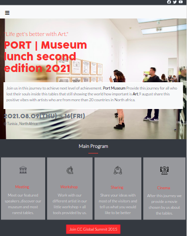
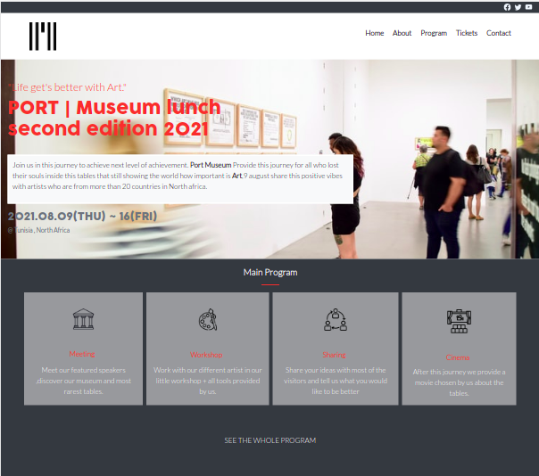

# Port | Museum

> This project is the final capstone for the first module (HTML - CSS).

Port museum project is a website for booking museum tickets. In this project I used HTML, Css and alot of Bootstrap to make my website more better. I v included Grid and flexbox to make the project more professional inside specific parts.

Screenshots :

## Built With 🔨

- HTML5/Css
- Bootstrap
- Visual Studio Code
- Git & Github

## Live Demo 👀

[Live Demo Link](https://hamdiheb.github.io/museum/)

### Install

To get a local copy up and running follow these simple example steps.
- Open terminal
- Clone this project by command git clone https://github.com/hamdiheb/museum.git
- Cd news-week folder
- Open index.html in browser

## Getting Started 
- Index.html is the main marke up that will show as the first page in the browser .
- about.html the page that contain all information you need to know about us .
- program.html contain the program schedule .
- tickets.html contain tickets prices .
- In css folder you will find the css file that contain all applicated designing on this project .
- Img folder contain most of pictures that has been in use for this project

### Prerequisites

- IDE to edit and run the code (We've used Visual Studio Code 🔥).

### Usage

- For anyone who wants to practice HTML5,Css and Bootstrap responsive design.
- How to apply responsive desing using Bootstrap and good practices.
- How to apply different design using Grid and flexbox.

## Author

👤 **Iheb Hamdi**

- GitHub: [@hamdiheb](https://github.com/hamdiheb)
- Twitter: [@hamdiheb](https://twitter.com/hamdiheb)
- LinkedIn: [Iheb Hamdi](https://www.linkedin.com/in/iheb-hamdi-b66084152/)

## 🤝 Contributing

Contributions, issues, and feature requests are welcome!

Feel free to check the [issues page](https://github.com/hamdiheb/museum/issues).

## Show your support

Give a ⭐️ if you like this project!

## Acknowledgments

- Hat tip to anyone whose code was used 🔰
- Inspiration 💘
- Microverse program ⚡
- My standup team 🏹
- 
Special thank to designer <a href="https://www.behance.net/adagio07">Cindy Shin | GUI & Graphic Designer</a> 

## 📝 License
This project is [MIT](./mit.md) licensed.